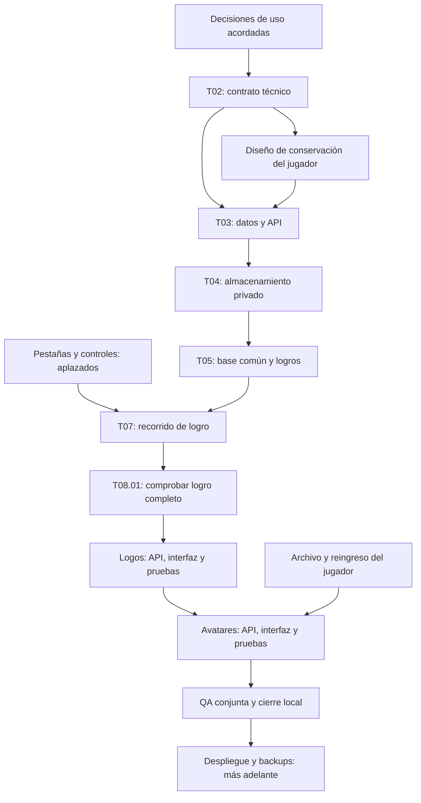

# Phase 7.10 — Imágenes y almacenamiento: plan de trabajo

Ubicación aprobada el 2026-09-24: después de Phase 7.9 y antes de continuar el frontal con imágenes reales. Denominación anterior: Phase 10A. Los IDs `MEDIA-10A-Txx` y `MEDIA-10A-Dxx` se conservan por trazabilidad; pertenecen ahora a 7.10, sin duplicar tareas.

Fecha: 2026-09-22. Actualizado: 2026-09-24. Estado: **PLAN DESGLOSADO · DECISIONES DE USO DEL ALCANCE LOCAL ACORDADAS · DISEÑO TÉCNICO E IMPLEMENTACIÓN PENDIENTES**. Ubicaciones de edición y backups aplazados expresamente.

Petición: adelantar un bloque de imágenes para probar el frontal con contenido real y dejarlo definido por tareas en el roadmap general. Alcance de esta sesión: documentación. Tipos, permisos, tamaños, compresión y comportamiento de uso acordados; montaje, mediciones y código pendientes. SeaweedFS inicial en servidor propio, pruebas aisladas en Windows y Cloudflare R2 como destino futuro preferido.

Lectura rápida: [resumen de acuerdos](#resumen-de-acuerdos) → [tareas y dependencias](#5-tareas-ejecutables-y-condiciones-de-cierre) → [pruebas de cierre](#6-pruebas-que-permiten-darlo-por-terminado). Relación general en [Roadmap, Phase 7.10](Roadmap.md#phase-710--imágenes-y-almacenamiento); archivo/eliminación de jugadores tiene [plan propio](PLAYER-LIFECYCLE-PLAN.md).

**Alcance reiterado por el usuario el 2026-09-23:** «no vamos a montar nada todavia, solo dejarlo bien definido». Esta revisión concreta el diseño en documentos: no crear contenedores, volúmenes, credenciales ni buckets, no instalar dependencias, no cambiar configuración ejecutable ni iniciar servicios. Las propuestas técnicas siguientes no se presentan como verificadas en ejecución.

## 1. Resultado que buscamos

Poder subir una imagen, relacionarla con su logro/equipo/persona, verla, reemplazarla o quitarla. Debe seguir disponible después de reiniciar o recrear el contenedor y respetar los permisos. La recuperación desde backup se aborda al preparar despliegue; no condiciona el piloto local.

| Pieza | Qué guarda | Ejemplo |
| --- | --- | --- |
| Base de datos | Propietario, relación con el recurso, identificador del archivo y metadatos necesarios | «Este archivo es la imagen del logro 42 de Halcones» |
| Almacenamiento | El archivo de imagen y las versiones de tamaño que se acuerden | Foto, avatar o logo transparente |
| Aplicación | Reglas de subida, lectura y presentación | Quién puede cambiarlo y quién puede verlo |

El almacén de objetos no comparte automáticamente las transacciones de PostgreSQL: el diseño debe resolver fallos entre guardar el archivo y guardar su referencia. Los archivos subidos no deben depender del código versionado ni de una carpeta temporal de ejecución.

### Resumen de acuerdos

| Tema | Contrato vigente |
| --- | --- |
| Alcance | Logros del catálogo → logos → avatar general y específico de equipo; un recorrido completo de logro antes de extender |
| Destino | SeaweedFS privado; un contenedor y volumen propios en Windows para pruebas; futuro servidor propio y R2 mediante operaciones S3 comunes |
| Entrada | PNG/JPG estáticos; máximo 10.000.000 bytes y 24.000.000 píxeles, ambos inclusive |
| Tamaños | Avatar 256 + 96 px; logo 512 + 128 px; logro 1280 + 640 + 320 px. Lado mayor salvo avatar cuadrado; no ampliar ni duplicar variantes equivalentes |
| Tratamiento | JPEG calidad 85; PNG sin pérdida adicional por compresión ni paletas; orientación/sRGB antes de retirar metadatos; transparencia conservada |
| Originales | Solo temporales; retirar tras éxito confirmado. Guardar principal procesada y variantes, sin historial de sustituidas |
| Cola | 2 procesamientos globales + 10 esperando, inicio por llegada; espera máxima 180 s y proceso 30 s; cola llena rechaza nueva admisión |
| Cambios | Anterior visible hasta reemplazo correcto; cancelar conserva anterior/respaldo. Un cambio pendiente por recurso, también entre pestañas/administradores |
| Seguimiento | Aviso minimizable, navegación interna y recuperación por consulta al volver; éxito/fallo reales, sin porcentajes inventados ni reenvío automático |
| Lectura | Backend autoriza cada petición; caché privada con revalidación de permiso/versión antes de reutilizar; almacén privado |
| Limpieza | Intento al terminar/fallar/cancelar; revisión horaria; temporales abandonados elegibles tras 24 h sin actividad ni referencias |
| Jugadores | Archivar conserva datos/avatar; eliminar explícitamente retira datos actuales, preservando históricos cerrados. Dependencia detallada en PLAYER-LIFECYCLE-PLAN |
| Aplazado | Pestañas/controles de edición e imagen durante/después de creación; backups/restauración al despliegue |

Las tareas siguientes convierten estos acuerdos en entregables; no vuelven a pedir elegir tamaños, proveedor o permisos. Una nueva decisión solo se eleva si cambia alcance, privacidad, coste o comportamiento aprobado. Las cifras de capacidad son estimaciones, no mediciones.

## 2. Encaje con el trabajo actual

- Reordenación 2026-09-24: A1-T04 y A2-T04/T05 aplazados hasta completar estructura G6–G8 y nuevas pestañas/controles acordados, antes de G9. G6 completada provisionalmente por decisión posterior del usuario; T03–T05 descartadas por ahora, sin gate visual PASS.
- Propuesta de orden: **decisiones de 7.10 → implementación acotada → imágenes de prueba reales → revisión de pantallas afectadas → completar estructura y nuevas pestañas/controles → retomar A1/A2 → G9**. El cierre provisional de G6 no reanuda G7–G9 automáticamente.
- Los gates G0–G5 existentes siguen siendo evidencia histórica válida. Incorporar imágenes exigirá regresión de las pantallas tocadas; no constituye una reaprobación automática de todo el frontal.
- El plan visual actual excluye media real. Al cerrar las decisiones, registrar expresamente la excepción para los tipos y pantallas aprobados. Banners y fotografía decorativa siguen fuera de esa excepción salvo acuerdo específico.
- #22 sigue logos; #23 sigue imágenes/avatares/almacenamiento. #27/#28 mantienen edición de identidad y alias; 7.10 no los absorbe. No crear issues duplicadas ni marcar las existentes como resueltas al aprobar el plan.
- Temporadas tiene migración local e integración #30/#29 verificadas según [Roadmap 7.9](Roadmap.md#phase-79--temporadas-por-equipo); administración visual y QA restante de #11 siguen pendientes. T02 debe comprobar el estado real del entorno antes de preparar media, sin repetir trabajo cerrado ni aplicar migraciones ajenas.

## 3. Decisiones, en este orden

Esta sección conserva el detalle y las alternativas consideradas. Los párrafos marcados como acordados y el resumen anterior son el contrato vigente. Las propuestas no elegidas no son requisitos. El diseño técnico derivado se concreta en T02/T03 sin reabrir decisiones ya aceptadas.

### D01 — Qué imágenes entran y qué queremos probar primero

**Acordado el 2026-09-22:** incluir imágenes de logros del catálogo, logos de equipos y avatar general con imagen opcional por equipo, por etapas y empezando por el recorrido completo de un logro. Confirmaciones: «Vamos con logros, logos y avatares si», «me gustaria que se pueda tener un avatar por equipo» y «foto general de usuario» como respaldo cuando no haya imagen del equipo. La comparación siguiente conserva las alternativas consideradas.

| Opción | Beneficio | Coste de alcance |
| --- | --- | --- |
| Logros + avatares + logos, entregados por etapas — elegida | Cubre catálogo, jugadores, ranking, identidad y selección de equipos | Requiere reglas de propiedad y controles de edición, incluido avatar general y por membresía |
| Solo imágenes de logros | Primer recorrido más pequeño para aprender y validar almacenamiento | Avatares/logos siguen provisionales y necesitarán una ampliación posterior |

Propuesta: una imagen actual por recurso. Construir primero el recorrido completo de un logro; después reutilizar lo aprendido para logo y avatar. Incluir subida, lectura, reemplazo, retirada y fallback en cada tipo aprobado.

**Fuera del primer bloque propuesto:** imágenes de propuestas antes de aprobación, galerías, documentos, vídeos, banners y fotografía de landing/login. La imagen adjunta a una propuesta necesita su propio ciclo de revisión, rechazo y traspaso al catálogo; se mantiene pendiente de Phase 10 hasta asignarla expresamente. Se podrán asociar imágenes a logros ya incorporados al catálogo.

Salida: lista de tipos aprobados, pantallas afectadas y orden de entrega. No se exige abrir las siete subrutas de administración para disponer de un control de imagen.

### D02 — Dónde viven los archivos

Previsión solicitada por el usuario: [MEDIA-CAPACITY.md](MEDIA-CAPACITY.md). Modelo por usuarios, avatares específicos, equipos y logros, con escenarios de peso y backups. Política acordada: sin conservar originales; la comparación con originales queda como alternativa descartada. Son supuestos de planificación; no cuotas ni capacidad física medidas. Ejemplo: 1.000 usuarios, 50 equipos y 2.500 logros requieren 2,715 GB de imágenes optimizadas en el escenario base o 8,140 GB en el pesado, antes de márgenes y backups.

**Destino y tipo acordados el 2026-09-22:** almacenamiento de objetos/blobs alojado en el servidor propio del usuario, por el carácter de aprendizaje del proyecto. Confirmación: «vamos a decidirnos por almacenamiento de objetos/blobs». Herramienta elegida posteriormente: SeaweedFS. No contratar almacenamiento externo en este bloque. Pendiente concretar montaje, capacidad, cantidad prevista de equipos/imágenes, crecimiento y responsable de las copias. Desarrollo continúa en Windows local con almacenamiento separado.

**Arquitectura elegida:** el backend valida subidas y permisos, y se comunica con un servicio de almacenamiento de objetos. PostgreSQL conserva referencias, relaciones y metadatos; el servicio conserva los archivos sobre almacenamiento persistente. La propuesta anterior de acceso directo del backend a una carpeta/volumen queda descartada para este bloque.

**Herramienta acordada el 2026-09-22: SeaweedFS.** El usuario acepta la recomendación por su encaje con el aprendizaje en servidor propio y la futura migración a R2. La portabilidad depende de usar operaciones S3 comunes y evitar dependencias exclusivas de SeaweedFS; no se afirma que sea la única herramienta adecuada ni que garantice una migración automática.

**Montaje de pruebas acordado el 2026-09-23:** un contenedor Docker para SeaweedFS y su almacenamiento persistente propio en Windows. No implica crear otro CT/VM de Proxmox. Antes de implementar, fijar versión mantenida, comprobar operaciones S3 requeridas, licencia, recursos y persistencia; las copias siguen aplazadas al despliegue. El servicio no sustituye los permisos de la aplicación. Esta decisión no equivale a haber desplegado ni probado SeaweedFS.

**Confirmación del usuario: «eso es, buen plan».** Añadir solo un contenedor SeaweedFS en modo `weed mini` al entorno Windows descrito en [LOCAL_WINDOWS](ui-workstream/LOCAL_WINDOWS.md), conservando PostgreSQL aislado y los procesos locales de backend/frontend. Configuración de almacenamiento separada del compose completo de aplicación, volumen persistente exclusivo para archivos y metadatos de SeaweedFS y bucket privado de desarrollo. Acceso privado con credenciales desde el backend. No reutilizar almacenamiento de producción ni crear otro CT/VM. El alojamiento futuro sigue siendo el servidor propio acordado, con almacenamiento y credenciales separados.

Fijar versión o digest verificado al implementar y declarar el modo de arranque explícitamente. Configurar credenciales locales desde el inicio, sin modo anónimo ni secretos versionados. Publicar el acceso S3 solo en loopback para el backend Windows; panel administrativo local solo si hace falta y sin publicar los demás puertos internos. El navegador obtiene imágenes a través del backend. Antes de arrancar, inventariar contenedores/puertos/recursos y verificar persistencia de objetos y metadatos tras recreación controlada. Sin pruebas de backup por ahora, conforme al aplazamiento de D07. Los límites de disco/RAM se concretarán con mediciones; no se declara un consumo validado. Referencia: [SeaweedFS, weed mini](https://github.com/seaweedfs/seaweedfs/wiki/Quick-Start-with-weed-mini).

**Especificación propuesta para revisión, sin montaje:**

| Elemento | Definición técnica propuesta |
| --- | --- |
| Servicio local | Contenedor `weblogros_media_windows`, SeaweedFS `weed mini`, sin dependencias que arranquen backend/frontend/DB adicionales |
| Persistencia | Volumen nombrado `weblogros_media_windows_data` montado en `/data`, incluyendo objetos y metadatos internos; recrear contenedor debe conservarlo |
| Acceso S3 | Puerto interno 8333 publicado como `127.0.0.1:8333`; backend Windows usa ese endpoint. Comprobar colisión de puerto antes de ejecutar y ajustar solo configuración si está ocupado |
| Espacio de archivos | Bucket privado `lockerboard-media-dev`; no un bucket por equipo. La aplicación conserva propietario/contexto y aplica aislamiento; conocer una clave no concede acceso |
| Credenciales | Separadas de las del futuro despliegue, solo configuración local ignorada por Git; cliente S3 del backend con permisos necesarios sobre el bucket, sin acceso anónimo. Verificar política real, no suponer que configurar claves basta para aislar todos los servicios internos |
| Superficie expuesta | Solo S3 en loopback por defecto. Filer, master, WebDAV y demás interfaces sin publicación al host. Administración, si hace falta, solo local y con su protección verificada |
| Compatibilidad | Endpoint, región, bucket, credenciales y modo de direccionamiento configurables; S3 path-style local si lo requiere la versión. Probar operaciones Put/Get/Head/Delete; ninguna URL de proveedor como referencia canónica en DB |
| Versión | Fijar versión explícita y digest comprobados al preparar ejecución; no usar `latest` ni actualización automática. Revalidar soporte de `mini`, configuración y licencia entonces |
| Recursos | Inventariar memoria/disco de Docker y backend, medir almacenamiento real y dos procesamientos máximos. El máximo 2 + 10 limita trabajos, no fija ni demuestra el consumo de SeaweedFS ni de los temporales acumulados |

Los nombres y puerto son detalles propuestos, no recursos creados. La persistencia de SeaweedFS no decide aún dónde estarán los temporales de subida/procesamiento: concretarlo con el diseño de trabajos en T02 sin exponerlos ni incluirlos en backups futuros.

**Destino futuro preferido, confirmado el 2026-09-22:** Cloudflare R2. El usuario indica «Cloudflare seria lo perfecto en el futuro». El despliegue inicial sigue en su servidor; esta preferencia no autoriza contratar ni migrar ahora. Diseñar la integración usando operaciones S3 comunes y contrastarlas con la [compatibilidad de R2](https://developers.cloudflare.com/r2/api/s3/api/), sin depender de funciones exclusivas del servicio local.

Para preparar esa portabilidad: guardar claves estables de objetos, no URLs completas del proveedor; configurar endpoint, credenciales, región y bucket por entorno; mantener permisos de aplicación en el backend. La futura migración debe copiar y verificar objetos y metadatos necesarios, coordinar las escrituras durante el cambio, comprobar acceso privado y disponer de vuelta atrás. No prometer una migración automática ni asumir equivalencia completa entre servicios S3. Revalidar tarifas y condiciones de R2 cuando se decida migrar.

La revisión local de `docker-compose.prod.yml` muestra que PostgreSQL ya tiene su volumen, pero el backend todavía no tiene uno de imágenes. El servicio de backup actual solo genera copias de PostgreSQL; habrá que incorporar los archivos y comprobar restauración conjunta. Esta revisión no verifica capacidad ni estado del servidor desplegado y no modifica infraestructura.

| Alternativa considerada | Qué implica | Resultado |
| --- | --- | --- |
| Disco persistente accesible directamente por el backend | El backend gestiona los archivos mediante el sistema de archivos | Descartada para este bloque tras la elección del usuario |
| Almacenamiento de objetos en servidor propio | Servicio dedicado, credenciales, persistencia y mantenimiento propios | SeaweedFS elegido; montaje de pruebas Windows acordado, versión y recursos pendientes |
| Almacenamiento de objetos gestionado externamente | Servicio externo para archivos, con costes y configuración de acceso | Cloudflare R2 preferido a futuro; fuera del despliegue inicial |

Motivo: aprender a integrar y mantener un servicio dedicado a archivos, separado de los datos relacionales. Se acepta incorporar ese componente al diseño; su despliegue sigue pendiente de las tareas del plan. Revisitar servicios externos solo si cambia la decisión de alojamiento.

Mantener identificadores de almacenamiento independientes de URLs públicas y rutas del ordenador; configuración separada por entorno; pruebas que nunca escriban en archivos de producción. Diseñar una interfaz pequeña de guardar/leer/eliminar para la herramienta elegida, sin implementar dos proveedores.

Salida: destino, presupuesto, responsable, ubicación persistente de desarrollo/producción y criterio que justificaría cambiarlo en el futuro. Los volúmenes sobreviven al ciclo de vida del contenedor, pero persistencia y copia de seguridad son responsabilidades distintas. [Docker: volúmenes](https://docs.docker.com/engine/storage/volumes/).

### D03 — Quién puede ver y cambiar cada imagen

Regla ya vigente: los logros del equipo son privados. La URL de una imagen no debe eludir esa regla.

**Avatar general y por equipo acordados el 2026-09-22:** una persona tiene una foto general y puede elegir una distinta en cada equipo. La foto general se relacionará con `User` y la específica con el contexto de `TeamMembership` (persona + equipo); el esquema exacto sigue pendiente de T03. Prioridad de presentación: **foto del equipo → foto general → iniciales**. Fuera del contexto de equipo se usa la general y, si falta, las iniciales.

La herencia se resuelve al leer, sin copiar la foto general a cada membresía: cambiarla actualiza los equipos que la usan por defecto y conserva las fotos específicas. Quitar una foto de equipo vuelve a mostrar la general; quitar la general conserva las específicas y deja iniciales donde no haya foto propia. Cambiar la imagen específica de un equipo no afecta a los demás.

**Conservación al salir del equipo acordada el 2026-09-23:** el usuario indica «esos avaters habra que guardarlos mientras el equipo exista». Salir o dejar de tener membresía activa no elimina el avatar específico ni sus variantes. Conservar su asociación estable persona + equipo mientras exista el equipo para recuperar la misma foto si esa cuenta vuelve. No guardar un historial de fotos sustituidas ni copiar el avatar general donde solo se heredaba. La retención no concede permisos: sin membresía activa se mantiene el rechazo de lectura/escritura contextual de D03; la visibilidad para miembros actuales sigue la matriz existente.

Esta imagen conservada no es un temporal ni un archivo huérfano: excluirla de la limpieza por abandono de 24 horas y de la limpieza de archivos sin referencia. El modelo de datos debe preservar la relación aunque una operación de salida retire la membresía activa. Los cambios/retiros explícitos de avatar siguen las reglas ya acordadas. Al eliminar definitivamente el equipo se podrán limpiar las imágenes específicas que ya no tengan referencias; archivar o desactivar no equivale a eliminar. No se implementa aquí borrado de equipos ni se decide el tratamiento de una futura eliminación de cuenta.

**Ampliación funcional acordada el 2026-09-23:** también se conservan ficha y datos históricos del jugador al salir (progreso, logros obtenidos y relaciones que sostienen rankings), salvo eliminación explícita por TEAM_ADMIN de su equipo. Separar permiso activo de registro histórico. Esta capacidad requiere trabajo de dominio más allá de media: [Architecture](Architecture.md) y [BACKEND-GAPS, apartado 21](ui-workstream/evidence/UI-A2/BACKEND-GAPS.md#21-conservación-del-jugador-y-baja-del-equipo). Aplicar las dos acciones acordadas a continuación; no convertir la salida en borrado ni crear ahora ese endpoint. T03 debe coordinar el diseño de relación persona + equipo con esa retención, sin ampliar automáticamente la implementación de 7.10 a todo el ciclo de baja.

**Archivar y eliminar acordados el 2026-09-23:** archivar retira acceso/listado habitual, conserva datos/resultados actuales y avatar específico con sus variantes, y permite recuperar la ficha al reingresar. Eliminar del equipo exige acción explícita de TEAM_ADMIN y confirmación de pérdidas, sin deshacer: retira datos actuales salvo referencias necesarias para resultados cerrados, borra el avatar específico y sus variantes sin referencias vigentes y cancela solicitudes pendientes. Mantiene decisiones resueltas y logros de catálogo nacidos de propuestas del jugador. Resultados cerrados conservan puntos y puestos, con último alias del equipo e iniciales; no heredar ahí la foto general. Tras eliminación, reingresar empieza una ficha actual nueva, sin recuperar progreso eliminado; los resultados cerrados anteriores permanecen. Nunca borrar cuenta/avatar general ni datos de otros equipos. La limpieza debe distinguir referencias históricas necesarias de una foto específica cuya retirada se ha acordado; coordinar fallos de borrado con D06. Ver matriz completa en Architecture/BACKEND-GAPS. Solo definición, sin ejecución.

**Visibilidad de avatares acordada el 2026-09-22:** la foto general es visible para cualquier usuario autenticado de la plataforma; la foto específica de un equipo, solo para miembros de ese equipo. No hay acceso anónimo. La foto general sigue teniendo alcance de plataforma aunque se muestre como respaldo dentro de un equipo. Esto no concede acceso a otras fotos específicas ni a datos privados. La edición queda acordada en la matriz siguiente; no se concede acceso de SUPER_ADMIN a fotos específicas sin membresía.

**Lectura de logos acordada el 2026-09-22:** cualquier usuario autenticado de la plataforma puede ver el logo de cualquier equipo, sin pertenecer a él ni disponer de invitación. Confirmación: «logo cualquier usuario de la plataforma puede verlo». No se acuerda acceso anónimo ni un directorio público de equipos. Esta visibilidad del logo no concede acceso al catálogo, jugadores u otros datos del equipo. La edición del logo corresponde a los TEAM_ADMIN de ese equipo según la matriz acordada.

**Edición acordada el 2026-09-22:** cada persona puede subir, cambiar y quitar sus avatares general y por equipo; los TEAM_ADMIN gestionan el logo y las imágenes de logros de su propio equipo. La aceptación «eso es» confirma esta matriz. Un administrador de equipo no modifica avatares ajenos. No se añade una excepción de escritura por ser SUPER_ADMIN.

| Imagen | Subir, cambiar y quitar — acordado | Lectura |
| --- | --- | --- |
| Logro del catálogo | TEAM_ADMIN del equipo propietario | Miembros del equipo y acceso global permitido por la política existente |
| Logo del equipo | TEAM_ADMIN de ese equipo | ACORDADO: cualquier usuario autenticado de la plataforma, sin membresía ni invitación; no acceso anónimo |
| Avatar general | La propia persona | ACORDADO: cualquier usuario autenticado de la plataforma; no acceso anónimo |
| Avatar por equipo | La propia persona, sobre su membresía activa de ese equipo | ACORDADO: solo miembros de ese equipo; no acceso anónimo ni excepción administrativa implícita |

La matriz, entrega, caché y conservación del avatar al salir/reingresar quedan acordadas. Concretar su coordinación técnica con sesiones y membresías, sin ampliar los permisos. Compartir el equipo B con alguien no concede acceso a su avatar del equipo A. SUPER_ADMIN conserva la lectura de logros prevista en la arquitectura; no se añaden privilegios sobre fotos específicas o escritura de media fuera de la matriz.

Entrega elegida el 2026-09-23: petición autorizada al backend; la comparación siguiente documenta la alternativa considerada. No convertir `/uploads/` en un directorio público de imágenes privadas. Si se estudian URLs firmadas, acordar duración y efecto de revocación: quien posee la URL puede usarla durante su validez. [AWS: URLs prefirmadas](https://docs.aws.amazon.com/AmazonS3/latest/userguide/using-presigned-url.html).

Salida: matriz de lectura/escritura por tipo, equipo y rol; comportamiento al perder permisos y reglas de caché coherentes con esa privacidad.

**Entrega acordada el 2026-09-23:** tras aclarar que no es una solución desechable ni exige sustituirla al migrar a R2, el usuario acepta continuar («vale vale, sigamos»). Servir las imágenes a través de una ruta protegida del backend, usando la sesión por cookie ya existente y comprobando en cada petición el permiso vigente sobre el recurso. El backend resuelve el identificador y la variante a una clave interna y lee el objeto privado por S3; el navegador no recibe credenciales ni una URL de acceso directo al almacén. Mantener la matriz acordada: logos/avatar general con sesión; avatar específico con membresía; logros con la política de lectura existente. Rechazar rutas/claves arbitrarias y limitar variantes a las generadas. Arquitectura elegida, revisable ante necesidades concretas de rendimiento; no hay sustitución futura programada.

**Caché acordada el 2026-09-23:** el usuario confirma «que el navegador conserve una copia, pero consulte al backend antes de reutilizarla, si». Caché privada del navegador con revalidación obligatoria (`Cache-Control: private, no-cache`) y `ETag` por imagen/versión/variante. Queda descartada la propuesta inicial de `no-store` para todas las imágenes. El navegador puede conservar los bytes; para reutilizarlos mediante la caché HTTP debe consultar al backend. Este autentica y autoriza primero, verifica que la versión siga vigente y después compara `If-None-Match`: responde `304` sin cuerpo solo si conserva permiso y coincide la versión; de lo contrario entrega la versión válida o rechaza la lectura. No considerar un `ETag` ni una URL de versión como credencial. Guardar el identificador/hash de cada variante al procesarla para no descargarla de SeaweedFS únicamente con el fin de validar su versión.

Aplicar la misma política a todos los tipos, incluidos logos y avatares generales porque también requieren sesión. Respuestas de error/autorización con `no-store`. No permitir caché compartida en proxies/CDN, almacenamiento de respuestas en service workers ni optimización del servidor que omita autorización. Servir variantes preprocesadas por el mismo origen `/api`; evitar el optimizador por defecto de Next Image para estas rutas porque no reenvía cabeceras de autenticación. Incluir cabeceras de caché/validación coherentes también en `304`.

Al reemplazar, generar identificador de versión nuevo y actualizar consumidores del recurso; las rutas de versiones retiradas no siguen accesibles por conservar el enlace o el validador. Al quitar imagen, usar fallback sin reutilizar su copia previa. Logout/cambio de cuenta vacía el estado visual y referencias en memoria de la aplicación. En restauración de historial (`pageshow`/bfcache) y retorno a pantallas protegidas, revalidar sesión/contexto antes de volver a presentar imágenes privadas. La caché HTTP privada no equivale a un almacén aislado por cuenta ni elimina archivos ya descargados: comprobar explícitamente cambio de cuenta en el mismo navegador. No ofrecer modo offline de estas imágenes; sin validación, no usar una copia antigua como fallback de error. La política no promete borrar capturas o copias ya entregadas ni retirada instantánea de imágenes ya visibles al cambiar permisos desde otro dispositivo.

Alternativa considerada y no elegida: `no-store` para todas las imágenes, que evita su almacenamiento en caché HTTP pero obliga a transferir de nuevo los bytes en posteriores peticiones. Ambas requieren los mismos permisos y tratamiento del estado de navegación. La política elegida sigue pendiente de implementación y prueba; `no-store` se mantiene para las respuestas de error/autorización. Referencias adicionales: [MDN, Cache-Control](https://developer.mozilla.org/en-US/docs/Web/HTTP/Reference/Headers/Cache-Control) y [MDN, ETag](https://developer.mozilla.org/en-US/docs/Web/HTTP/Reference/Headers/ETag).

Consecuencia de la entrega elegida: perder membresía impide nuevas lecturas de imágenes privadas de ese equipo; cerrar sesión impide nuevas lecturas autenticadas desde esa sesión del navegador. No se pueden retirar bytes ya descargados, imágenes ya visibles o capturas. La ruta compartida con otra persona exige sus propios permisos. Las transferencias pasan por el backend; la caché privada acordada permitirá ahorrar bytes cuando la imagen no cambia, conservando la consulta de permisos. La migración futura del almacén a R2 puede conservar esta interfaz, pero servir directamente desde R2 requeriría revisar el modelo de entrega.

Alternativa considerada y no elegida: enlaces firmados de corta duración, que permiten descargar directamente del almacén y reducen el tráfico del backend, pero cualquiera que posea el enlace puede usarlo hasta su caducidad. No se modifica código por registrar la elección. Referencias consultadas: [R2, enlaces firmados](https://developers.cloudflare.com/r2/api/s3/presigned-urls/), [MDN, Cache-Control](https://developer.mozilla.org/en-US/docs/Web/HTTP/Reference/Headers/Cache-Control), [Next Image](https://nextjs.org/docs/app/api-reference/components/image).

### D04 — Qué archivos aceptamos y cómo deben verse

**Formatos acordados el 2026-09-22:** solo PNG y JPG/JPEG estáticos para imágenes de logros, logos y avatares (general y por equipo). Confirmación del usuario: «png y jpg solo». `.jpg` y `.jpeg` representan el mismo formato admitido. WebP, GIF, SVG, PNG animados y demás formatos quedan fuera de este bloque. Las versiones procesadas también se limitarán a PNG/JPEG, sin introducir WebP automáticamente.

Conservar transparencia cuando exista en PNG, especialmente en logos; JPG/JPEG no tiene transparencia. Los logos mantienen la presentación acordada: completos, conservando proporción y sin recuadro añadido por la interfaz. Admitir JPG no elimina el fondo que ya esté incorporado en el archivo.

**Escala acordada por el usuario el 2026-09-22:** avatares pequeños, logos intermedios e imágenes de logros con la mayor resolución. La referencia máxima de presentación de un logro es [detalle comunitario](../apps/frontend/LockerBoard-marca/ReferenciasPaginas/comunidad/%5Bid%5D/detalle-logro-comunitario-desktop-v1.png); los avatares toman como referencia la página actual `/equipos/halcones/jugadores`. Esto usa la referencia comunitaria para dimensionar imágenes; no incorpora la funcionalidad de comunidad a 7.10.

Comprobación de solo lectura del 2026-09-22:

- PNG canónico de 1672 × 941 px: bloque principal del logro aproximadamente 487 × 517 px en la lámina, medido visualmente; no es una medida CSS de una página implementada.
- Navegador en `/equipos/halcones/jugadores`, captura observada y rectángulos DOM: avatar propio 96 × 96 px, administración/sesión 44 × 44 px y filas 32 × 32 px. Son placeholders actuales, no fotos implementadas.
- [PlayerAvatar.tsx](../apps/frontend/src/app/components/team/PlayerAvatar.tsx) declara además 80 px para identidad en móvil y hasta 120 px para podio. Estos últimos valores se comprobaron en código, no como prueba visual adicional.

**Resoluciones principales acordadas el 2026-09-22:** el usuario acepta avatar 256 × 256 px, logo hasta 512 px y logro hasta 1280 px en el lado mayor. Logos y logros completos, conservando proporciones; sin ampliar artificialmente fuentes pequeñas.

**Variantes pequeñas acordadas el 2026-09-24:** tras explicar su coste adicional, el usuario confirma «comprendo, es un extra aceptable si». Guardar los tamaños de la tabla a partir de una sola subida; generación y selección automáticas, sin gestión adicional del usuario. No ampliar fuentes pequeñas ni guardar versiones duplicadas cuando el tamaño de entrada no permita generar tamaños distintos. La anterior propuesta de logo de 256 px no se incluye en el conjunto elegido. Compresión confirmada posteriormente el 2026-09-24 (JPEG 85 y PNG sin pérdida adicional); validación de resultados pendiente; esta aceptación cierra las dimensiones y el coste adicional previsto, no acredita medidas de peso reales.

| Tipo | Versión principal acordada | Variantes pequeñas acordadas | Tratamiento |
| --- | --- | --- | --- |
| Avatar general / por equipo | 256 × 256 px | 96 × 96 px para filas y sesión | Encuadre cuadrado y presentación circular; vista previa circular con movimiento y zoom antes de guardar, acordada |
| Logo de equipo | Hasta 512 px en el lado mayor | Hasta 128 px en el lado mayor | Mantener proporción, transparencia PNG y logo completo; sin recorte |
| Imagen de logro | Hasta 1280 px en el lado mayor | Hasta 320 y 640 px en el lado mayor | Conservar una versión completa con su proporción; encuadre de tarjetas por concretar, sin recortar destructivamente la principal |

Estas cifras se basan en las referencias, con margen para pantallas de alta densidad. Un avatar de 256 px cubre hasta 120 px de presentación aproximadamente al doble de densidad; el logro principal cubre el bloque de la lámina con margen superior al doble. Servir la variante adecuada al espacio y densidad; no descargar la principal en todas las listas. Si cambia el máximo de presentación, revisar las variantes. No ampliar artificialmente una fuente pequeña ni prometer más detalle del que contiene. Referencia técnica: [MDN, imágenes adaptables](https://developer.mozilla.org/en-US/docs/Web/HTML/Guides/Responsive_images).

**Límites de entrada acordados el 2026-09-22:** el usuario confirma «me parece correcto si» a **hasta 10 MB y hasta 24 megapíxeles por imagen**, para avatares generales/específicos, logos y logros. Deben cumplirse ambos límites: archivo ≤ 10.000.000 bytes y ancho × alto ≤ 24.000.000 píxeles, con dimensiones válidas. Por ejemplo, 6.000 × 4.000 px cumple el límite de resolución; una foto de 48 MP no lo cumple aunque pese 8 MB. Los valores son inclusivos y usan unidades decimales. Validar en el servidor el archivo recibido, no solo los datos declarados por el navegador; explicar si el rechazo es por peso o resolución. El límite de bytes se refiere al archivo, no al cuerpo completo de la petición.

**Resolución de salida no equivale a límite de subida.** La aplicación reducirá las entradas admitidas a los tamaños principales acordados. El peso final depende del contenido y formato, especialmente en PNG: no se fija una garantía de KB solo por reducir dimensiones. Límites iniciales acordados, sujetos a prueba de consumo con dos entradas máximas antes de habilitarlos. Cerrar imágenes por recurso, cuota por usuario/equipo y presupuesto de procesamiento tras revisar recursos en T02. No se han medido aún CPU, memoria o espacio del servidor.

**Concurrencia y cola acordadas el 2026-09-22:** máximo de **2 imágenes procesándose simultáneamente entre todos los usuarios** del entorno; no 2 por usuario, equipo o instancia del backend. Cada imagen ocupa un turno durante su recorte, compresión y generación de todas sus variantes. Hasta **10 imágenes adicionales esperan** por orden de llegada, con estado visible «Esperando para procesar»: máximo de 12 trabajos admitidos entre activos y pendientes. El usuario confirma «lo veo bien si». La espera se guarda temporalmente sin descomprimir; los trabajos pueden finalizar en distinto orden aunque comiencen por llegada. Con cola llena, no admitir otra imagen y mostrar «Hay muchas imágenes en espera. Inténtalo de nuevo en unos instantes», conservando la imagen actual. Espera máxima de 180 s, procesamiento de 30 s y tratamiento de fallos/reinicios acordados en D06; control de admisión durante transferencia y coordinación técnica pendientes. Los límites de entrada son 10 MB y 24 MP, sujetos a prueba de consumo. No se selecciona todavía tecnología de cola. Si hay varias instancias, el diseño debe mantener los topes globales. Verificar memoria y tiempos con dos imágenes de entrada máxima antes de habilitarlo; el acuerdo no acredita que el servidor soporte cualquier tamaño.

**Conservación acordada el 2026-09-22: sin originales.** Confirmación del usuario: «sin originales». Guardar de forma permanente solo la imagen principal procesada y las variantes necesarias, en PNG/JPEG. El original será temporal durante la subida y el procesamiento; retirarlo tras verificar el procesamiento, el guardado de las versiones definitivas y su asociación correcta al recurso. No incluir originales temporales en las copias de seguridad. Ante fallo o abandono, limpiar los temporales mediante el ciclo de vida de D06, cuyos plazos quedan acordados el 2026-09-23 y cuyo mecanismo técnico sigue pendiente; conservar la imagen anterior si falla un reemplazo. La decisión no ejecuta una limpieza ahora.

Consecuencia: las futuras variantes o recortes partirán de la principal procesada; para recuperar detalle descartado será necesario volver a subir la fuente. Tamaños principales y encuadre de avatar acordados; dimensiones de variantes y calidad numérica pendientes de concretar y probar.

**Encuadre de avatares acordado el 2026-09-22:** el usuario confirma «eso es» a una vista previa circular donde puede mover la foto y ajustar el zoom antes de guardar, tanto para avatar general como específico de equipo. Guardar el encuadre elegido como imagen cuadrada, con presentación circular en la interfaz; no incorporar un fondo circular al archivo. La imagen final y sus variantes deben corresponder a la vista previa. El zoom respetará la regla de no ampliar artificialmente una fuente pequeña. Tras descartar el original, recuperar zonas excluidas requerirá volver a subir la fuente. Esta decisión define el flujo, no un editor general de imágenes ni una implementación existente.

**Compresión acordada el 2026-09-24 («Comprension esa si»):** JPEG con calidad inicial 85; PNG sin pérdida adicional por compresión después del redimensionado, conservando transparencia y sin optimización por paletas. Mantener PNG/JPEG según entrada. Validar calidad visual, bytes y consumo con el lote real; 85 es un ajuste de calidad, no un porcentaje de peso ni una medición de fidelidad. Dimensiones de variantes ya acordadas. Para logos: conservar transparencia y proporción. Concretar presentación de tarjetas de logros, cuya principal se conserva completa.

**Metadatos y paletas, 2026-09-24:** el usuario pide quitar todos los metadatos incrustados (GPS, cámara, fecha de captura, autor, comentarios, miniaturas, EXIF/XMP/IPTC y perfiles originales). Aplicar previamente orientación y normalización de color a sRGB; conservar los datos estructurales necesarios para decodificar PNG/JPEG y la transparencia PNG. Dimensiones, formato y peso de salida se registran separadamente en la base de datos; no conservar metadatos personales de origen allí. Diseño pendiente de implementación y validación.

El usuario descarta expresamente la idea de optimizar mediante paletas («nah, descartar esta idea»): no añadir conversión a PNG indexado ni reducción/agrupación de colores, tampoco el camino opcional de paleta exacta propuesto. Esto no excluye una entrada PNG estática que ya use paleta ni modifica los tamaños acordados. La retirada de metadatos se mantiene; JPEG 85 se aprobó posteriormente mediante la confirmación de compresión registrada arriba.

Validar el archivo real, además de extensión y tipo declarado; limitar la carga antes y durante el procesamiento, generar nombres internos y proteger las escrituras autenticadas por cookie frente a peticiones no autorizadas. [OWASP: subida de archivos](https://cheatsheetseries.owasp.org/cheatsheets/File_Upload_Cheat_Sheet.html).

Salida: tabla de formatos/límites por tipo, reglas de transformación, mensajes de rechazo y ejemplos visuales aceptables.

### D05 — Dónde se suben y cómo se conectan con el frontal

**Proceso en segundo plano acordado el 2026-09-22:** al confirmar la imagen, permitir seguir usando y navegando por la aplicación mientras termina. Mostrar un aviso flotante no bloqueante, minimizable, asociado al recurso y equipo correctos. Estados: «Subiendo imagen» → «Esperando para procesar» cuando corresponda → «Procesando imagen» → «Imagen actualizada». Si falla, mostrar alerta con explicación y acción de reintento manual cuando sea pertinente. Minimizar el aviso no cancela el trabajo; no mostrar éxito hasta verificar guardado y asociación al recurso. Mantener la imagen anterior mientras se completa o si falla; si no había imagen, conservar el fallback. No convertir un fallo de imagen en fallo del resto de una operación ya completada ni declarar completada una creación que aún no se haya guardado.

Mostrar porcentaje solo cuando sea medible (por ejemplo, transferencia); durante procesamiento usar indicador de actividad y texto, sin porcentaje ni cuenta atrás inventados. El aviso debe mantenerse al navegar dentro de la aplicación, identificar el destino original aunque cambie el equipo visible y anunciar los cambios de estado de forma accesible. Rutas y posición visual exacta pendientes de D05/T07.

El procesamiento debe continuar en el servidor una vez recibido y admitido el archivo; no depender de mantener abierto el formulario. Cerrar/recargar la pestaña antes de terminar la transferencia puede interrumpirla: no prometer subida después de cerrar el navegador.

**Recuperación del aviso acordada el 2026-09-24 («aceptamos tu propuesta si»):** al recargar o volver a la aplicación, consultar al backend el estado real del trabajo del usuario autorizado. Si sigue esperando/procesando, recuperar el aviso correspondiente; si terminó correctamente, mostrar la imagen vigente y «Imagen actualizada»; si falló, mantener la anterior/respaldo y mostrar alerta con reintento manual. No reenviar la imagen ni iniciar otro trabajo automáticamente por volver a la página. Mantener el destino original y consultar también cancelación/interrupción para no mostrar un procesamiento inexistente. Si no se puede consultar, no inferir éxito ni fallo del trabajo a partir de la desconexión. La garantía de continuidad empieza cuando el servidor ha recibido/admitido el archivo; una transferencia incompleta puede requerir seleccionar y subir de nuevo la fuente.

T02 concretará persistencia/consulta del estado, cierre de sesión, reconocimiento y caducidad de avisos, sin exponer trabajos de otra cuenta ni eludir permisos vigentes. El comportamiento de recuperación queda aprobado; sus detalles técnicos e implementación siguen pendientes. No se fija aquí una duración nueva para avisos o registros.

**Ubicaciones aplazadas por el usuario el 2026-09-22:** «ya lo definiremos mas adelante, faltan pestañas nuevas». Definir los puntos de edición al concretar esas pestañas; no asumir que las pantallas existentes sean el destino definitivo. La propuesta conversada (perfil, Mi progreso personal, configuración y detalle de logro) no queda aprobada. También sigue pendiente si la imagen se añade durante o después de crear el logro. El aplazamiento no cambia los permisos ni el flujo en segundo plano ya acordados, ni impide avanzar en las decisiones independientes de almacenamiento y ciclo de vida.

Inventariar las pantallas existentes y previstas que van a mostrar y editar cada tipo cuando se retome D05. Las siguientes son propuestas provisionales, no ubicaciones elegidas:

- Logro: control administrativo en detalle o gestión existente, sin ampliar la edición del resto de campos.
- Logo: control de identidad del equipo accesible al administrador.
- Avatar general: control propio de imagen general, separado de la edición completa de perfil #27. Avisar de que el cambio afecta a los equipos que usan esa foto por defecto.
- Avatar por equipo: control propio dentro del equipo, indicando a qué equipo afecta y permitiendo volver a usar la foto general. Fuera del contexto de equipo se presenta foto general → iniciales; concretar rutas/componentes sin ampliar otros campos de perfil.

Acordar si la imagen se añade después de crear el recurso —recorrido inicial recomendado— o durante su creación. La segunda opción requiere tratar subidas abandonadas si el formulario nunca se envía.

Representar selección, vista previa, envío, espera en cola («Esperando para procesar»), procesamiento, éxito, error, cancelación y retirada; mantener imagen anterior durante un reemplazo fallido. En ambos avatares incluir la vista previa circular con movimiento y zoom acordada en D04, antes de guardar. Cancelar selección antes del envío debe ser posible.

**Cancelación y sustituciones simultáneas acordadas el 2026-09-24:** «Cancelar, pues deja la que estaba. No dejar subir otra mientras se procesa una». Permitir cancelar el cambio pendiente durante subida, espera y procesamiento antes de publicar la sustitución; conservar la imagen anterior o el respaldo existente si no había imagen propia. No publicar posteriormente el resultado cancelado; retirar temporales/resultados no asociados conforme a D06. Cancelar no elimina la imagen vigente ni equivale a deshacer una sustitución ya completada: si publicación y cancelación coinciden, determinar y comunicar el resultado real sin prometer recuperación de una imagen ya sustituida. No liberar un turno mientras el trabajo continúe consumiendo recursos.

El bloqueo se aplica a la misma imagen/recurso, conforme a la pregunta sobre sustituirla mientras se procesa: no admitir otro cambio durante subida/espera/procesamiento o cancelación aún pendiente. Aplicarlo también en backend ante pestañas o administradores concurrentes, no solo deshabilitando el control; permitir nueva subida cuando el trabajo haya terminado, fallado o confirmado cancelación. No se acuerda un bloqueo global para toda la plataforma ni un nuevo límite por usuario; se conservan los topes globales 2 + 10. Al recargar/volver, recuperar estado y bloqueo real conforme al acuerdo de D05.

Salida: rutas/componentes exactos, permisos visibles y contrato de datos. Si hay que modificar shell o primitivas congeladas, registrar la excepción y su regresión con Coordinator.

### D06 — Qué pasa al reemplazar, borrar o fallar una operación

**Tiempos y fallos acordados el 2026-09-22:** hasta **180 segundos en cola** desde la admisión en espera y hasta **30 segundos de procesamiento** desde el inicio del trabajo (recorte, compresión y variantes). Al superar un plazo, detener/cancelar el trabajo correspondiente y ofrecer reintento manual; no liberar un turno de procesamiento mientras la ejecución siga consumiendo recursos ni permitir que publique un resultado tardío. No hay reintentos automáticos en esta primera versión. Archivo inválido o excesivo: explicar la causa y pedir otro archivo. Fallo de servidor/almacenamiento: alerta y reintento manual. Reinicio del procesador: los trabajos pendientes/en curso afectados quedan interrumpidos y requieren reenvío manual, salvo los que ya se habían completado correctamente; verificar el resultado persistido para evitar falsos fallos. Una desconexión del navegador no equivale a fallo confirmado del servidor.

Conservar siempre la imagen anterior hasta completar correctamente el reemplazo. Concretar límites de transferencia/guardado, coordinación de timeout y publicación, recuperación de estados y reintento cuando la fuente ya no esté disponible en el navegador. Los tiempos acordados están pendientes de prueba con imágenes reales, no son una medición de rendimiento.

**Limpieza acordada el 2026-09-23:** el usuario confirma «me encaja» a estas reglas:

- Tras éxito, retirar el original temporal; en sustituciones, retirar también la imagen anterior y sus variantes sin referencias tras completar el reemplazo.
- Al detectar fallo o caducidad, intentar limpiar los temporales del trabajo una vez detenido, sin tocar la imagen vigente.
- Revisar restos y borrados pendientes automáticamente **cada hora** y reintentar su eliminación. No reintentar el procesamiento de imágenes: ese reintento sigue siendo manual.
- Los temporales abandonados son elegibles para borrado tras **24 horas de abandono/inactividad**, comprobando que no estén referenciados ni pertenezcan a un trabajo o transferencia activos. Concretar la detección fiable de actividad en T02; no inferir abandono solo de la antigüedad de un archivo.
- La revisión horaria puede retirar un temporal en el primer barrido posterior al umbral; no promete borrado al segundo exacto ni durante una caída del servicio. Registrar los fallos de limpieza para seguimiento.

Estas 24 horas son un margen para limpiar restos, no amplían los 180 s de cola ni los 30 s de procesamiento. El mecanismo técnico, la coordinación con trabajos concurrentes y la verificación de propiedad/referencias quedan por implementar y probar. La decisión no ejecuta ninguna limpieza ni programa una automatización de esta conversación.

**Sustitución acordada el 2026-09-23:** el usuario confirma «al sustituirla borramos la anterior». Aplicar a logros, logos y ambos avatares: guardar y validar la imagen nueva y sus variantes, asociarlas correctamente al recurso y después eliminar la principal anterior y sus variantes cuando ya no estén referenciadas. Sin historial de imágenes sustituidas en el almacenamiento activo. Si falla el reemplazo, conservar la anterior. Cambiar un avatar específico que heredaba la foto general no permite borrar esa foto general: sigue perteneciendo al usuario y puede utilizarse en otros contextos.

Si falla el borrado tras un reemplazo correcto, registrar limpieza pendiente y reintentar su eliminación sin deshacer la nueva imagen ni borrar archivos referenciados. El reintento de limpieza es distinto del reintento manual de una subida fallida; aplicar la revisión horaria acordada y concretar su mecanismo técnico. No sobrescribir una misma clave de archivo y dejar versiones antiguas en caché. Las copias de seguridad existentes siguen su propia retención, pendiente de D07; esta decisión no ordena purgarlas ni ejecuta ahora ningún borrado.

Aplicar la política sin originales de D04: entrada temporal, retirada tras éxito y limpieza de temporales fallidos o abandonados. Aplicar los plazos acordados; definir mecanismo de limpieza de archivos sin referencia, referencias compartidas, dos reemplazos simultáneos, doble envío, fallo de almacenamiento y fallo de base de datos. Acordar qué pasa si se elimina la entidad propietaria, sin introducir una nueva función de borrado de usuarios/equipos por este plan.

Salida: ciclo de vida y recuperación documentados, con una operación administrativa de limpieza verificable y limitada a archivos propios del sistema. Sin historial de imágenes sustituidas, conforme al acuerdo del 2026-09-23.

### D07 — Cómo recuperamos los archivos y con qué material probamos

**Copias aplazadas por el usuario el 2026-09-23:** «las copias de seguridad ya se vera una vez se vaya a desplegar la app». Destino, frecuencia, retención, responsable, implementación de copias y prueba de restauración se retomarán al preparar el despliegue. No son un requisito previo del piloto local ni bloquean el diseño/desarrollo de media. Mantener persistencia y pruebas de reinicio/recreación en el alcance local. La preparación del lote de imágenes de QA sigue vigente. No modificar ni desactivar las copias existentes por este aplazamiento.

- Elegir destino, frecuencia, retención, responsable y límites de pérdida/tiempo de recuperación de las copias. Coordinar archivos y sus referencias en la base de datos para poder restaurarlos juntos.
- Relacionarlo con el pendiente de copias offsite de Phase 5.5: una copia de PostgreSQL no contiene las imágenes externas. Definir copia fuera del servidor y seguimiento de errores; no dar ese pendiente por cerrado por añadir un volumen.
- Al preparar el despliegue, concretar y comprobar copia/restauración conjunta en destino aislado, además de revisar HTTPS/configuración del entorno. Esta prueba queda aplazada y no se exige al piloto local.
- Elegir imágenes propias, autorizadas o creadas expresamente para pruebas. Incluir logo transparente, imágenes vertical/horizontal/cuadrada y casos sin imagen. No descargar retratos ni usar fotos personales sin autorización.
- Guardar un manifiesto reproducible: archivo, procedencia, recurso de prueba, dimensiones y hash. El fixture de QA usa archivos reales controlados; los datos de dominio siguen viniendo del backend.

Salida: procedimiento de copia/restauración, criterio de producción y lote de prueba con origen conocido. No fijar fecha de entrega antes de cerrar alcance y destino.

## 4. Registro de decisiones

| ID | Tema | Estado | Elección y motivo |
| --- | --- | --- | --- |
| MEDIA-10A-D01 | Tipos y primer recorrido | ACORDADA | 2026-09-22: logros del catálogo, logos y avatar general con imagen opcional por equipo; primero un logro de principio a fin. Prioridad: equipo → general → iniciales; pantallas y controles exactos se concretan en D05 |
| MEDIA-10A-D02 | Destino, capacidad y coste | DESTINO ACORDADO / TÉCNICA PENDIENTE | SeaweedFS, pruebas Windows y futuro R2 acordados. T02.01/T02.02 concretan versión, compatibilidad, recursos y operación; T04 verifica persistencia. Sin arranque |
| MEDIA-10A-D03 | Lectura, edición y privacidad | PRODUCTO ACORDADO / TÉCNICA PENDIENTE | Matriz, backend privado, caché revalidada y conservación acordados. T03.01/T03.02 concretan contrato y referencias; T05.04 implementa lectura. Dependencia PLAYER-LC-T01/T03 para historial y avatares |
| MEDIA-10A-D04 | Formatos, límites y presentación | PRODUCTO ACORDADO / VALIDACIÓN PENDIENTE | Formatos, límites, tamaños/variantes, encuadre de avatar, JPEG 85, PNG sin paletas y retirada de metadatos acordados. T05.02 implementa; T06.01/T08.02 miden calidad y consumo. Encuadre visual de tarjetas se concreta con T07.01 |
| MEDIA-10A-D05 | Puntos de edición y conexión UI | PARCIAL — UBICACIONES APLAZADAS | Segundo plano, cancelación y recuperación del aviso al recargar/volver acordados: consultar estado real, recuperar espera/proceso, mostrar imagen actualizada o alerta de fallo sin reenvío automático. Persistencia/caducidad de avisos pendientes de diseño. Puntos de edición aplazados hasta definir nuevas pestañas; no aprobados los destinos propuestos ni añadir imagen después de crear logro |
| MEDIA-10A-D06 | Reemplazo, retirada y fallos | PRODUCTO ACORDADO / TÉCNICA PENDIENTE | Cancelación, bloqueo por recurso, tiempos, conservación de anterior y limpieza acordados. T02.03/T03.02 definen coordinación; T05.03/T05.05/T05.06 implementan y prueban carreras/fallos |
| MEDIA-10A-D07 | Copias, restauración y material QA | COPIAS APLAZADAS / QA PENDIENTE | Usuario aplaza estrategia, implementación y restauración de backups hasta preparar despliegue. No bloquea piloto local; lote de QA sigue pendiente |

Registrar fecha y elección explícita al resolver cada fila. Las decisiones acordadas se reflejan después en `docs/Decisions`; Architecture solo describe la solución cuando corresponda, sin presentar este plan como implementación existente.

## 5. Tareas ejecutables y condiciones de cierre

Coordinator conserva el control del estado. Los roles indican responsabilidad futura, no despacho de agentes en esta sesión. Ejecución secuencial; no repartir escrituras sobre schema, almacenamiento o shell entre trabajos simultáneos. Se mantienen los IDs T00–T09 ya referenciados; las subtareas nuevas los desglosan, no crean una segunda entrega.

**DONE** acredita únicamente el entregable descrito. **TODO** significa trabajo pendiente, no autorizado para ejecución por esta petición. En T07.01, las ubicaciones están además **APLAZADAS POR EL USUARIO**. T01 se cierra solo para decisiones de uso del alcance local; no declara resueltos ni ejecutados diseño técnico, ubicaciones o backups.

| Tarea | Estado | Responsable | Depende de | Entregable y condición de cierre |
| --- | --- | --- | --- | --- |
| MEDIA-10A-T00 — Preparar este plan | DONE | Coordinator | Petición del usuario | Plan y desglose reconciliados con Roadmap el 2026-09-24 |
| MEDIA-10A-T01 — Decisiones de uso locales | DONE | Coordinator + usuario | T00 + confirmaciones hasta 2026-09-24 | Contrato del resumen acordado; ubicaciones y backups segregados explícitamente |
| MEDIA-10A-T02 — Viabilidad y contrato técnico | TODO | Backend / Coordinator | T01 | Subtareas T02.01–T02.04 completas; ninguna tecnología/versión nueva queda elegida solo por figurar como candidata |
| MEDIA-10A-T03 — Datos, API y pruebas | TODO | Backend | T02 + PLAYER-LC-T01 para relación de equipo | Diseño verificable, migración propuesta y pruebas definidas; sin ejecutar migración en esta tarea |
| MEDIA-10A-T04 — Almacenamiento persistente | TODO | Backend / infraestructura | T03 + solicitud de implementación | Almacén aislado privado y operaciones/persistencia comprobadas; backups fuera del cierre local |
| MEDIA-10A-T05 — Subida, procesamiento y lectura | TODO | Backend | T04; dependencias por tipo abajo | Base común y logros, luego logos y avatares con pruebas; no cerrar por entregar solo un tipo |
| MEDIA-10A-T06 — Lote real de prueba | TODO | QA | T02.01 para material; API de cada tipo para carga | Corpus autorizado y cargas reproducibles por etapa, sin reset destructivo |
| MEDIA-10A-T07 — Integración del frontal | TODO | Frontend / Coordinator | T07.01 + API/lote del tipo correspondiente | Logros → logos → avatares completos; controles y pantallas previamente definidos |
| MEDIA-10A-T08 — QA funcional y visual | TODO | QA / Coordinator | Por etapa; cierre tras T05–T07 | Matriz de la sección 6 PASS, consumo medido y regresión final; comparación directa Coordinator según override vigente |
| MEDIA-10A-T09 — Cierre local | TODO | Coordinator | T08 | Evidencia, apuntes, docs y pendientes sincronizados; sin implicar publicación/despliegue ni cierre de A1/A2/G6 |

### 5.1 Orden de entrega y dependencias

El diagrama muestra entregas, no estados de ejecución. Las dependencias exactas están en las tablas. El backend y el material de prueba pueden prepararse antes de resolver las pestañas; **no se considera completo el recorrido de logro ni se pasa al siguiente tipo hasta su verificación T08.01**. Si se mantiene el aplazamiento de pantallas, documentar entrega de API, sin inventar un control temporal en producto.

### 5.2 Diseño e infraestructura

Prefijo completo de todos los IDs abreviados de esta sección: `MEDIA-10A-`. Todas las subtareas siguientes están **TODO**, salvo T07.01 que está **APLAZADA**.

| ID | Responsable | Depende de | Alcance y criterio de cierre |
| --- | --- | --- | --- |
| T02.01 — Inventario de partida | Backend / Coordinator | T01 | Leer LOCAL_WINDOWS, cambios concurrentes, migraciones y capacidades vigentes. Registrar qué existe, qué falta y entorno aislado objetivo; comprobar evidencia de temporadas/#29/#30 sin repetir ni ejecutar sus migraciones. Identificar consumidores afectados, sin montar servicios |
| T02.02 — Componentes y recursos | Backend | T02.01 | Especificar versión/digest y configuración SeaweedFS, cliente S3, receptor de uploads y procesador de imágenes; verificar compatibilidad y licencia al seleccionar. Definir temporales, presupuesto de disco/RAM y medición, límites de transferencia/guardado/admisión. No contratar ni añadir otro servicio sin justificarlo; umbrales no medidos se etiquetan como provisionales |
| T02.03 — Trabajos y recuperación | Backend | T02.02 | Elegir mecanismo de cola/ejecución y persistencia. Diagramar estados de subida/admisión, espera, proceso, publicación, éxito/fallo/cancelación/interrupción; definir cancelación real, bloqueo por recurso, control global 2 + 10, 180/30 s, reinicio y consulta al volver. Fijar reconocimiento/caducidad de avisos y política de peticiones repetidas; documento revisable, sin código |
| T02.04 — Contrato técnico cerrado | Coordinator / Backend | T02.01–T02.03 | Registrar decisiones derivadas, límites de recepción y consumo, matriz de errores/recuperación y alcance de cada entrega. Resolver cuotas/límites de abuso que afecten al usuario como decisión de producto si fueran necesarios; no inventar cuotas aprobadas. Ubicaciones/backups permanecen aplazados, no bloquean este contrato |
| T03.01 — Operaciones y permisos | Backend | T02 | Definir contratos de subir/consultar estado/cancelar/leer/reemplazar/retirar, respuestas y errores, sesión y protección de escrituras. Lectura aplica permisos antes de ETag/304; concretar rutas coherentes con convenciones existentes. No publicar contratos especulativos en frontend |
| T03.02 — Referencias e integridad | Backend | T03.01 + PLAYER-LC-T01 | Modelar imagen, variantes, propietario, trabajo y limpieza pendiente; claves independientes de proveedor, sin URLs canónicas. Definir asociación atómica y recuperación entre objetos/DB, bloqueo entre pestañas, cambios de permiso durante trabajo y publicación. Referencia persona/equipo estable al archivar; separar historial tras eliminación |
| T03.03 — Migración y pruebas diseñadas | Backend / QA | T03.02 | Especificar migración aditiva, transición, recuperación y coordinación con PLAYER-LC-T02; fixtures y pruebas con resultado esperado para sección 6. Revisión del diseño sin ejecutar migraciones ni generar clientes |
| T04.01 — Servicio aislado | Backend / infraestructura | T03 + implementación solicitada | Preflight de entorno y arranque exclusivo SeaweedFS con versión fijada, volumen propio, credenciales no versionadas y bucket privado. Solo acceso local necesario; inventario antes/después acredita que no se duplican DB/backend/frontend |
| T04.02 — Adaptador y persistencia | Backend / QA | T04.01 | Guardar/leer/consultar/eliminar objetos con configuración por entorno; verificar ausencia de acceso anónimo, errores controlados y persistencia tras reinicio/recreación. Pruebas S3 necesarias para portabilidad; no implementar R2 ni backup ahora |

### 5.3 Backend, por recorridos completos

| ID | Responsable | Depende de | Alcance y criterio de cierre |
| --- | --- | --- | --- |
| T05.01 — Persistencia y recepción | Backend | T04.02 | Aplicar solo migración diseñada para media en entorno autorizado; guardar estados duraderos y recibir una entrada temporal con límites/admisión. No cargar pendientes descomprimidas en RAM. Pruebas de recepción incompleta, límites y reenvíos sin duplicar trabajos |
| T05.02 — Transformación | Backend | T05.01 + T06.01 | Validar contenido real, estático y límites bytes/píxeles; orientación, sRGB, retirada de metadatos, encuadre de avatar y variantes pactadas, JPEG 85 y PNG sin paletas. Pruebas contra corpus, sin ampliación ni variantes duplicadas; no prometer peso máximo por dimensiones |
| T05.03 — Cola, tiempos y cancelación | Backend | T05.02 | Implementar estados/persistencia, 2 activos + 10 esperando globales, orden de inicio, 180/30 s, bloqueo por recurso y consulta/cancelación. Reinicio interrumpe afectados y reconcilia completados; prueba de carrera cancelar/publicar y ausencia de ejecución tras liberar turno |
| T05.04 — Lectura privada y caché | Backend | T05.01 | Entregar variantes por backend autenticado con autorización vigente y ETag. 304 solo tras permiso/versión, errores no-store, sin bucket público ni optimizador que comparta privados. Verificar sesión caducada, revocación y cambio de cuenta |
| T05.05 — Recorrido de logro | Backend | T05.03 + T05.04 | Subir, asociar, ver, sustituir y retirar imagen de catálogo por TEAM_ADMIN. Mantener anterior hasta éxito, impedir publicación si cambió permiso/recurso y registrar limpieza pendiente tras fallos. Pruebas HTTP de recorrido, aislamiento y concurrencia PASS |
| T05.06 — Limpieza segura | Backend | T05.05 | Retirar original tras éxito, resultados cancelados/fallidos y anteriores sin referencias. Barrido horario, abandono 24 h con comprobación de actividad/referencias; reintentar borrado sin reprocesar. Probar caída de DB/almacén, conservación de foto heredada/archivada y límites del directorio/bucket propio |
| T05.07 — Logos | Backend | T08.01 del recorrido de logro | Reutilizar flujo común para logos: edición TEAM_ADMIN propio, lectura cualquier usuario autenticado, sin acceso anónimo ni a otros datos. Mismas garantías de reemplazo/cancelación y transparencia; pruebas de otro equipo y usuario sin equipo |
| T05.08 — Avatares general y de equipo | Backend | T07.03 verificado + PLAYER-LC-T03 | Aplicar propiedad/lectura diferenciadas, recorte común y equipo → general → iniciales sin duplicar foto heredada. Salida/archivo conserva imagen sin acceso; reingreso recupera. Probar aislamiento, retirada de cada nivel y referencias retenidas. Eliminación completa del jugador se prueba en PLAYER-LC-T04, no se oculta como terminada aquí |

Los cambios de dominio de jugador se ejecutan en [PLAYER-LIFECYCLE-PLAN](PLAYER-LIFECYCLE-PLAN.md), no dentro de estas tareas. T05.08 requiere conservación/archivo/reingreso; no exige acabar su interfaz administrativa ni su eliminación explícita para cerrar media local, siempre que se registre ese alcance pendiente.

### 5.4 Material y frontal

| ID | Responsable | Depende de | Alcance y criterio de cierre |
| --- | --- | --- | --- |
| T06.01 — Corpus autorizado | QA | T02.01 | Seleccionar imágenes propias/autorizadas con logo transparente, retratos autorizados o sintéticos, logro horizontal/vertical/cuadrado, EXIF/orientación/perfil de color y entradas inválidas/límite. Manifiesto con procedencia, dimensiones y hash; no fotos personales obtenidas sin autorización |
| T06.02 — Carga repetible por etapa | QA | T06.01 + API de cada tipo (T05.05/T05.07/T05.08) | Cargar mediante flujo real en recursos de prueba identificados; registrar IDs, variantes y bytes, sin rutas locales en producto ni reset de fixtures ajenos. Se cierra tras las tres etapas; su parte de logros habilita T07.02 |
| T07.01 — Ubicaciones y excepción visual | Coordinator / Frontend | Usuario retoma nuevas pestañas + T03.01 | APLAZADA. Elegir controles, imagen durante/después de creación y encuadre de tarjetas, reutilizando #27/#28/UI-G8 sin absorberlos. Registrar lista de pantallas/tipos autorizados para sustituir placeholders; banners/fotografía/propuestas excluidos |
| T07.02 — Logro de principio a fin | Frontend | T05.05 + T05.06 + T06.02-logros + T07.01 | Subida/preview/retirada, tamaños adaptados y fallback; aviso flotante accesible que sobrevive navegación y consulta al volver. Cancelar/bloqueo/errores reales, sin porcentajes inventados ni éxito antes de asociación. Entregar a T08.01 antes de ampliar tipos |
| T07.03 — Logos | Frontend / QA | T05.07 + T06.02-logos + T07.01 | Mostrar y editar logo en pantallas acordadas, sin recorte ni fondo añadido; variantes adecuadas. Pruebas de permisos y recorrido básico, escritorio/móvil, PASS antes de iniciar avatares |
| T07.04 — Avatares | Frontend / QA | T05.08 + T06.02-avatares + T07.01 | General/específico con destino explícito, vista previa circular movible/zoom, teclado y móvil. Validar fallback, cancelación, bloqueo y recarga; no añadir edición de otros datos de perfil/alias ni controles de archivo/eliminación no acordados |

### 5.5 Verificación y cierre

| ID | Responsable | Depende de | Alcance y criterio de cierre |
| --- | --- | --- | --- |
| T08.01 — Puerta de recorrido de logro | QA / Coordinator | T07.02 | Subir → navegar/recargar → ver → cancelar/reemplazar → retirar, con permisos/fallos y regresión de pantallas tocadas. Evidencia local reproducible y revisión visual Coordinator; PASS habilita logos |
| T08.02 — Carga, formatos y consumo | QA / Backend | T05.06 + T06.01 | Medir dos entradas máximas, 10 en espera, cola llena, tiempos y temporales acumulados. Verificar metadatos retirados, transparencia y calidad 1×/2×; registrar bytes reales de cada variante y actualizar MEDIA-CAPACITY. No ampliar límites silenciosamente si fallan |
| T08.03 — Regresión conjunta | QA / Coordinator | T05–T07 completos + T08.01/T08.02 | Ejecutar matriz sección 6, fallos de DB/almacén, permisos al publicar, sesiones/ETag, cancelación/reinicio y referencias retenidas. Lint/build y tests dirigidos, capturas escritorio/móvil y comparación Coordinator. Sin P0/P1 materiales ni pruebas críticas pendientes |
| T09.01 — Evidencia y aprendizaje | Backend / QA / Coordinator | T08.03 | RESULT con entorno, versiones, comandos/casos/resultados y límites; apuntes de bloques implementados y notas pedagógicas verificadas. Todo enlazado desde el plan, sin declarar pruebas no ejecutadas |
| T09.02 — Sincronizar entrega | Coordinator | T09.01 | Actualizar Roadmap, Decisions/Architecture, gap correspondiente a #22/#23, STATUS/TASKS y pendientes del plan de jugadores. Diferenciar piloto local, publicación y despliegue; conservar A1/A2/G6 y pendientes 5.5/#11/#27/#28 |

Ruta prevista de evidencia: `docs/media/evidence/<ID>/`, con un índice final `docs/media/RESULT.md`; se crearán al ejecutar, no son resultados existentes. Cada subtarea se cierra con enlace a evidencia y fecha. La matriz de la sección 6 es el mínimo de cobertura; no repetir pruebas completas sin cambios o dudas nuevas.

### 5.6 Trabajo aplazado y seguimiento futuro

Las ampliaciones de producto pertenecen a Phase 10. Despliegue/backups y migración R2 tienen seguimiento independiente, al final del roadmap para el despliegue definitivo, con backups como último bloque de preparación/verificación. R2 se activa al solicitar migración; no condicionan el piloto local:

| ID | Estado | Activador / dependencias | Entregable y cierre |
| --- | --- | --- | --- |
| MEDIA-DEP-T01 | APLAZADA | Preparar despliegue en servidor propio | Dimensionamiento medido, configuración/versiones, almacenamiento/credenciales separados de Windows, acceso privado y comprobación HTTPS; plan operativo de mantenimiento |
| MEDIA-DEP-T02 | APLAZADA | MEDIA-DEP-T01 + retomar decisión de backups | Destino, frecuencia, retención, responsable y recuperación acordados para DB + archivos; enlazar pendiente offsite Phase 5.5 |
| MEDIA-DEP-T03 | APLAZADA | MEDIA-DEP-T02 | Implementar y probar backup/restauración conjunta en destino aislado, sin originales temporales; evidencia y alertas operativas |
| MEDIA-DEP-T04 | APLAZADA | T09 + MEDIA-DEP-T01–T03 + despliegue solicitado | Desplegar y verificar recorrido/permisos/persistencia/recuperación en servidor; no equivale al PASS local |
| MEDIA-R2-T01 | FUTURA | Decisión expresa de migrar | Revalidar compatibilidad/precios; plan de copia verificada, cambios de escritura, comprobación de permisos y vuelta atrás; ejecutar solo con alcance solicitado |
| MEDIA-EXT-T01 | FUTURA | Retomar Phase 7.7 / resto de Phase 10 | Definir imágenes de propuestas: permisos, rechazo, conservación y traspaso al catálogo; no incorporarlas silenciosamente al flujo de logros |

Otros tipos de media continúan fuera de alcance hasta definirlos. No se fija calendario de implementación sin inventario y diseño T02/T03; las dependencias indican el orden realizable.

Antes de iniciar T03, deben estar resueltas las decisiones necesarias para el alcance concreto que el usuario pida ejecutar. Las copias D07 aplazadas no bloquean trabajo local; las ubicaciones D05 se retomarán antes de integrar sus controles. Esta petición sigue siendo de planificación, sin ejecución autorizada todavía; no se exige aprobación adicional para cada paso rutinario una vez solicitado el alcance de implementación.

Durante implementación backend: explicar cada concepto antes del bloque, verificarlo, añadir las notas `// 📚` pertinentes y documentarlo en `docs/apuntes.md`. No escribir ahora apuntes de una implementación inexistente.

## 6. Pruebas que permiten darlo por terminado

| Área | Evidencia esperada |
| --- | --- |
| Recorrido básico | Subir → recargar → ver → reemplazar → retirar; resultado correcto en cada tipo aprobado |
| Permisos | Usuario sin sesión, miembro, administrador, otro equipo y usuario con varias membresías; URL directa no elude permisos |
| Avatar general y por equipo | Persona con varias membresías: prioridad equipo → general → iniciales. Cambiar la general actualiza solo contextos que la heredan; quitar la específica recupera la general; quitar la general conserva específicas. Fuera de equipo: general → iniciales. Verificar lectura, edición y salida/reingreso conforme a permisos y conservación acordados |
| Avatar conservado tras salida | Salir/archivar conserva principal, variantes y relación persona + equipo, pero retira acceso contextual. Tras más de 24 h y limpieza horaria sigue conservado; al reingresar con la misma cuenta se recupera sin duplicarlo, salvo eliminación explícita anterior. Sin específico previo se hereda general/iniciales. No borrar por archivo huérfano ni por recrear membresía; retirada/reemplazo explícitos mantienen reglas existentes |
| Dependencia de eliminación del jugador — gap 21 | Cuando se implemente ese alcance de dominio, probar retirada del avatar específico y variantes sin tocar general/otros equipos; históricos cerrados con último alias e iniciales, sin fallback a general. Reingreso tras eliminación no recupera avatar/progreso eliminados. La coordinación se diseña en T03; esta fila no autoriza implementar bajas ni exige integrarlas automáticamente en 7.10 |
| Lectura de logos | Usuario autenticado de otro equipo o sin membresías puede ver el logo, incluso sin invitación; usuario anónimo no. No amplía acceso al catálogo ni a otros datos/archivos del equipo |
| Lectura de avatares | General accesible con sesión incluso sin equipo compartido; específica accesible solo con membresía del equipo correspondiente. Sin sesión no hay acceso. Compartir otro equipo no basta; comprobar también URL directa y no ampliar permisos por el fallback |
| Edición de imágenes | Persona sube/reemplaza/retira sus avatares; no los ajenos. TEAM_ADMIN gestiona logo/logros de su equipo, no de otros ni avatares ajenos. PLAYER no gestiona logo/logros. Sin sesión o sin membresía activa no se permite la escritura contextual |
| Archivos inválidos | Tipo falso, archivo corrupto, formato excluido, bytes/píxeles excesivos y límites de uso; rechazo sin publicar archivo ni dejar referencia rota |
| Límites de entrada | En todos los tipos, comprobar fronteras de 10.000.000 bytes y 24.000.000 píxeles con archivos válidos; rechazar superar cualquiera aunque cumpla el otro. Validación del servidor y mensaje de causa. Medir memoria/tiempos con 2 entradas máximas, incluidas PNG detalladas, antes de habilitar |
| Formatos acordados | Aceptar PNG estático y JPEG válido con extensión .jpg/.jpeg; rechazar WebP, GIF, SVG y PNG animado aunque se renombren. Preservar transparencia PNG y generar solo variantes PNG/JPEG |
| Compresión y metadatos | JPEG calidad 85, PNG sin indexación/reducción de paleta; verificar transparencia, orientación y color normalizados. Comprobar ausencia de EXIF/XMP/IPTC, GPS, miniaturas y perfiles originales en todas las variantes; metadatos personales de entrada no copiados a DB/logs. Comparar imágenes reales antes/después de forma visual y medir bytes, sin prometer pérdida nula por redimensionado/JPEG |
| Sin originales | Tras éxito quedan principal procesada y variantes necesarias, con referencias válidas; original temporal retirado y excluido de backups. Fallo/abandono: limpieza según plazo acordado y conservación de la imagen anterior en reemplazos fallidos |
| Resoluciones por uso | Verificar nitidez de avatar propio/filas/podio y logro al tamaño de referencia, con densidades 1×/2×; variantes pequeñas en listas, logos completos, sin ampliación artificial ni cambio de proporción. Medir bytes resultantes de fotos e ilustraciones PNG/JPEG reales antes de cerrar presupuestos |
| Fallos y concurrencia | Caída de almacenamiento/DB, doble envío y dos reemplazos; imagen anterior conservada cuando corresponde y limpieza comprobable |
| Borrado tras sustitución | Nueva principal y variantes guardadas/asociadas antes de borrar anteriores; sin historial activo. Fallo de reemplazo conserva anterior; fallo de borrado deja limpieza pendiente sin deshacer nueva imagen. No borrar referencias compartidas ni avatar general al añadir específico. Dos reemplazos simultáneos no deben borrar la imagen finalmente vigente |
| Limpieza automática | Intento tras éxito/fallo y revisión de restos cada hora; temporales abandonados elegibles tras 24 h de inactividad. Verificar antes/después del umbral, referencias vigentes y trabajos/transferencias activos, incluso si el archivo es antiguo. Fallo de borrado queda registrado; reintentar limpieza no vuelve a procesar imágenes ni borra imagen vigente. Coordinar limpieza con reemplazos concurrentes |
| Segundo plano y avisos | Navegar por la app y cambiar equipo durante subida/espera/proceso sin perder seguimiento ni cambiar el destino; minimizar no cancela. Estados reales, sin porcentaje ficticio; éxito solo tras guardado/asociación, alerta y reintento manual al fallar. Verificar recuperación de estado al volver según contrato y ausencia de exposición entre usuarios |
| Recuperación al recargar/volver | Tras recepción/admisión del archivo, recargar durante espera/proceso y recuperar estado real sin duplicar trabajos; volver tras éxito muestra imagen vigente y aviso, tras fallo mantiene anterior/respaldo y alerta. Recuperar cancelación/interrupción sin publicar resultado cancelado ni bloquear indefinidamente. Transferencia incompleta y fallo de consulta no se confunden con éxito/fallo confirmado del procesamiento. Verificar cambio de cuenta y pérdida de permisos, sin mostrar trabajos ajenos |
| Cancelación y bloqueo por recurso | Cancelar durante transferencia/espera/procesamiento conserva anterior o respaldo y evita publicación tardía; gestionar carrera con publicación sin anunciar cancelación falsa. Segundo cambio del mismo recurso rechazado también desde otra pestaña/administrador; liberar bloqueo tras fin real, fallo o cancelación confirmada. Limpieza no borra imagen vigente; topes 2 + 10 permanecen globales |
| Plazos e interrupciones | Expirar espera a 180 s y procesamiento a 30 s; no publicación tardía ni liberación de turno mientras siga trabajando. Sin reintento automático; trabajos afectados por reinicio se muestran interrumpidos, distinguiendo los ya completados. Desconexión del navegador no prueba fallo del servidor. Conservación de imagen anterior y limpieza de temporales verificables |
| Procesamiento limitado | Subidas de varios usuarios/equipos: nunca más de 2 imágenes activas y 10 esperando en el entorno, incluidas sus variantes; la tercera espera y muestra su estado. Inicio por orden de llegada; con 12 trabajos ocupados se rechaza otra admisión con aviso y se conserva la imagen actual. Verificar tiempo de espera y recuperación según contrato pendiente, y medir memoria/tiempos con dos entradas máximas. Comprobar topes globales si hay varias instancias |
| Sesión y caché | Escrituras con protección acordada, logout/retirada de membresía y caducidad; comportamiento privado conforme a D03 |
| Caché privada acordada | Con permiso y versión vigente, revalidación devuelve 304 sin reenviar imagen; sin permiso nunca 304 aunque el ETag coincida. Reemplazo/retirada rechazan versiones anteriores; cambio de cuenta y navegación atrás no reutilizan estado privado sin validación. Caída de red no autoriza uso offline de caché; proxies/optimizadores no comparten respuestas |
| Persistencia | Reinicio y recreación controlada de la app mantienen las imágenes; prueba sobre almacenamiento aislado |
| Restauración — aplazada al despliegue | Recuperar archivos y referencias coherentes en destino aislado y abrir imágenes reales desde la app restaurada; no es condición de cierre del piloto local |
| Presentación | PNG transparente completo, orientación correcta, recortes acordados, carga lenta, imagen ausente/error y móvil sin saltos ni overflow |
| Encuadre de avatar | General y específico: mover y ajustar zoom en vista previa circular antes de guardar; principal cuadrada y variantes coinciden con el encuadre mostrado, sin ampliación artificial. Verificar controles por teclado y móvil; cancelar selección no altera la foto existente |
| Accesibilidad | Controles con nombre, uso por teclado, estado de envío/error anunciado y texto alternativo adecuado |
| Regresión | Login/registro, selección de equipo, catálogo/detalle, dashboard, ranking y jugadores afectados siguen funcionando; lint/build y pruebas dirigidas |

La prueba local del alcance no aplazado acredita **piloto local**, sin acreditar copias/restauración. Al preparar producción, retomar D07 junto con configuración real, migraciones autorizadas, acceso privado y capacidad. Conservar el pendiente de copias externas del roadmap; no marcar publicación/despliegue como realizados por haber terminado el código o las capturas.

## 7. Próximo paso

**MEDIA-10A-T02.01 — inventario de partida**, seguido de T02.02/T02.03 y PLAYER-LC-T01. Son tareas de diseño/read-only hasta que se solicite implementación: identificar entorno, migraciones, consumidores y relaciones, y preparar el contrato técnico sin montar servicios.

El plan por tareas está preparado y las decisiones de uso locales están cerradas. Falta ejecutar el diseño técnico T02/T03 y después solicitar el alcance de implementación. No hay que volver a decidir proveedor, tamaños, compresión, permisos, cola, cancelación ni recuperación del aviso. Las mediciones se realizan en T04/T08 y pueden motivar una revisión explícita de límites si la evidencia lo exige.

Las ubicaciones de edición T07.01 se retoman con las nuevas pestañas; sin ellas se puede avanzar en diseño y backend pero no dar por cerrado el recorrido completo de UI. Las copias se retoman en MEDIA-DEP al preparar despliegue. No avanzar current_task visual, crear issues remotas ni ejecutar tareas por haberlas documentado.

## Fuentes

- Estado del proyecto: [Roadmap](Roadmap.md), [Architecture](Architecture.md), [STATUS](ui-workstream/STATUS.md), [PLAN visual](ui-workstream/PLAN.md), [pendientes #22/#23](ui-workstream/evidence/UI-A2/BACKEND-GAPS.md).
- Referencias técnicas consultadas el 2026-09-22: documentación de [Docker sobre volúmenes](https://docs.docker.com/engine/storage/volumes/), guía [OWASP sobre subida de archivos](https://cheatsheetseries.owasp.org/cheatsheets/File_Upload_Cheat_Sheet.html) y documentación de [AWS sobre URLs prefirmadas](https://docs.aws.amazon.com/AmazonS3/latest/userguide/using-presigned-url.html). Son referencias para comparar opciones, no selección de proveedor ni de librería.
